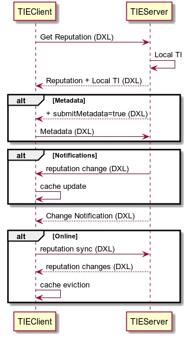

General message flow
====================

In a real world environment it is expected that the TIE service will be consuming reputations from multiple products and providing reputations to multiple products, each with their own set of services, events, and requests. One of the key concerns for the design of a new integrating product is that it properly publishes and requests reputations from the TIE service. TIE will also store and share details about threat prevalence and spread.

The TIE Server uses two types of communication:

Service-based (Request\Response)
 The TIE service is exposed via DXL allowing for DXL clients to request reputations for files and certificates. The TIE service responds to requests via a one-to-one communication, meaning the communication is solely between an invoking client and the TIE service.

Event-based (Publish\Subscribe)
    The TIE service provides topics where DXL clients can subscribe to and the TIE service publishes events to those specific topics. When the TIE service publishes events to its topics, all subscribed clients receive the event.

The following diagram shows a generic overview of the typical flow of messages across a TIE server and its clients.

